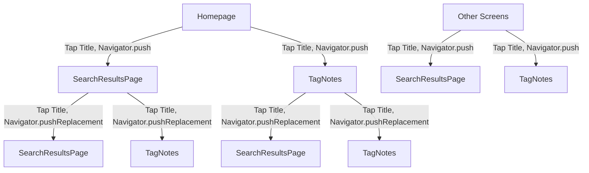

# Navigation Replacement Plan for Happy Notes App

## Goal
Modify the navigation behavior so that tapping on the title in `SearchResultsPage` and `TagNotes` replaces the current page with a new `TagNotes` or `SearchResultsPage` (or other relevant screens) instead of pushing a new page onto the navigation stack, preventing redundant stacking of similar pages.

## Steps

1. **Update `NavigationHelper` to Handle Conditional Replacement for Tag and Search Navigation**:
   - Modify the `showTagInputDialog` method or create a new utility method in `navigation_helper.dart` to accept a `replacePage` parameter. This parameter will determine whether to use `Navigator.pushReplacement` or `Navigator.push` when navigating to `TagNotes` or `SearchResultsPage`.
   - Alternatively, check the current route name or pass a flag to determine if the navigation is originating from `TagNotes` or `SearchResultsPage`, and use `pushReplacement` in those cases.

2. **Modify `SearchResultsPage`**:
   - Update the `onTap` callback for the title `GestureDetector` in `search_results_page.dart` (line 68) to pass a `replacePage: true` parameter when calling `NavigationHelper.showTagInputDialog`, ensuring that navigation replaces the current page.

3. **Modify `TagNotes`**:
   - Update the `onTap` callback for the title `GestureDetector` in `tag_notes.dart` (line 69) to pass a `replacePage: true` parameter when calling `NavigationHelper.showTagInputDialog`, ensuring that navigation replaces the current page.

4. **Preserve Existing Behavior for Other Screens**:
   - Ensure that navigation from other screens, including the homepage, continues to use `Navigator.push` (i.e., `replacePage: false`) to maintain the ability to return to the previous screen when navigating to `TagNotes` or `SearchResultsPage`.

5. **Test Navigation Behavior**:
   - Verify that navigation from `SearchResultsPage` and `TagNotes` replaces the current page when tapping the title and navigating to another `TagNotes` or `SearchResultsPage`, preventing stacking of similar pages.
   - Confirm that back navigation or popping behaves appropriately, potentially returning to a higher-level screen in the navigation stack when using `pushReplacement`.

## Navigation Flow Diagram

This diagram illustrates that from the Homepage and other screens, navigation to `SearchResultsPage` or `TagNotes` pushes a new page, allowing back navigation to the previous screen. From within `SearchResultsPage` or `TagNotes`, navigation to another instance of these screens replaces the current page, preventing unnecessary stacking.